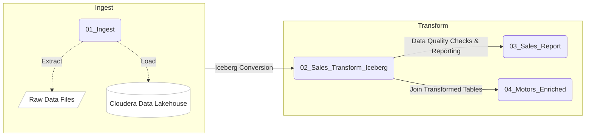

# CDE Workshop HOL

## Objective

CDE is the Cloudera Data Engineering Service, a containerized managed service for Cloudera Data Platform designed for Large Scale Batch Pipelines with Spark, Airflow and Iceberg. It allows you to submit batch jobs to auto-scaling virtual clusters. As a Cloud-Native service, CDE enables you to spend more time on your applications, and less time on infrastructure.

CDE allows you to create, manage, and schedule Apache Spark jobs without the overhead of creating and maintaining Spark clusters. With CDE, you define virtual clusters with a range of CPU and memory resources, and the cluster scales up and down as needed to run your Spark workloads, helping to control your cloud costs.

This Hands On Lab is designed to walk you through CDE's main capabilities. Throughout the exercises you will:

1. Deploy an Ingestion, Transformation and Reporting pipeline with Spark.
2. Learn about Iceberg's most popular features using Spark.
3. Orchestrate pipelines with Airflow.
4. Using the CDE CLI to execute Spark Submits and more from your local machine.
5. Navigate into Data Linage and Cluster Auto Scaling

## Table of Contents
* [Introduction to the CDE Data Service](/README.md#introduction-to-the-cde-data-service)
* [Requirements](/README.md#requirements)
    * [Project Setup](/README.md#project-setup)
    * [CDP User & Credentials](/README.md#cdp-user--credentials)
    * [CDE CLI Setup](/README.md#cde-cli-setup)
* [Lab 1: Implement a Spark Pipeline](/README.md#lab-1-implement-a-spark-pipeline)
    * [1.1 Editing Files and Creating CDE Resources](/README.md#11-editing-files-and-creating-cde-resources)
    * [1.2 Creating CDE Spark Jobs](/README.md#12-creating-cde-spark-jobs)
* [Lab 2: Orchestrating Pipelines with Airflow](/README.md#lab-2-orchestrating-pipelines-with-airflow)
    * [2.1 Executing Airflow Basic DAG](/README.md#21-executing-airflow-basic-dag)
    * [2.2 Executing Airflow Logic Dag](/README.md#22-executing-airflow-logic-dag)
    * [2.3 Using CDE Airflow with CDW](/README.md#23-using-cde-airflow-with-cdw)
    * [2.4 Using the CDE Airflow Editor to Build Airflow DAGs without Coding](/README.md#24-using-the-cde-airflow-editor-to-build-airflow-dags-without-coding)
* [Lab 3: Using the CDE CLI](/README.md#lab-3-using-the-cde-cli)
    * [3.1 Run Spark Job from Local](/README.md#31-run-spark-job-from-local)
    * [3.2 Run Spark Job from Resource](/README.md#32-run-spark-job-from-resource)
    * [3.3 Using CDE Interactive Session](/README.md#33-using-cde-interactive-session)
    * [3.4 Learning to use the CDE CLI](/README.md#34-learning-to-use-the-cde-cli)
* [Lab 4: CDE Tuning and Scaling](/README.md#lab-4-cde-tuning-and-scaling)
    * [4.1 Setup Spark Jobs](/README.md#41-setup-spark-jobs)
    * [4.2 CDE Job Analysis](/README.md#42-cde-job-analysis)
    * [4.3 Tuning](/README.md#43-tuning)
* [Lab 5: Data Lineage](/README.md#lab-5-data-lineage)
    * [5.1 End-to-End Data transformation Overview](/README.md#51-overview-of-the-end-to-end-data-transformation)
    * [5.2 Trace Lineage from CDE to HIVE](/README.md#52-trace-lineage-from-cde-to-hive)
    

## Introduction to the CDE Data Service

Cloudera Data Engineering (CDE) is a serverless service for Cloudera Data Platform that allows you to submit batch jobs to auto-scaling virtual clusters. CDE enables you to spend more time on your applications, and less time on infrastructure.

Cloudera Data Engineering allows you to create, manage, and schedule Apache Spark jobs without the overhead of creating and maintaining Spark clusters. With Cloudera Data Engineering, you define virtual clusters with a range of CPU and memory resources, and the cluster scales up and down as needed to run your Spark workloads, helping to control your cloud costs.

The CDE Service can be reached from the CDP Home Page by clicking on the blue "Data Engineering" icon.


The CDE Landing Page allows you to access, create and manage CDE Virtual Clusters. Within each CDE Virtual Cluster you can  create, monitor and troubleshoot Spark and Airflow Jobs.

The Virtual Cluster is pegged to the CDP Environment. Each CDE Virtual Cluster is mapped to at most one CDP Environment while a CDP Environment can map to one or more Virtual Cluster.

These are the most important components in the CDE Service:
* **CDP Environment**:
A logical subset of your cloud provider account including a specific virtual network. CDP Environments can be in AWS, Azure, RedHat OCP and Cloudera ECS. For more information, see [CDP Environments](https://docs.cloudera.com/management-console/cloud/overview/topics/mc-core-concepts.html). Practically speaking, an environment is equivalent to a Data Lake as each environment is automatically associated with its own SDX services for Security, Governance and Lineage.
* **CDE Service**:
The long-running Kubernetes cluster and services that manage the virtual clusters. The CDE service must be enabled on an environment before you can create any virtual clusters.
* **Virtual Cluster**:
An individual auto-scaling cluster with defined CPU and memory ranges. Virtual Clusters in CDE can be created and deleted on demand. Jobs are associated with clusters.
* **Jobs**:
Application code along with defined configurations and resources. Jobs can be run on demand or scheduled. An individual job execution is called a job run.
* **Resource**:
A defined collection of files such as a Python file or application JAR, dependencies, and any other reference files required for a job.
* **Job Run**:
An individual job run.

**CDE User Interface**
The Home Page provides a high level overview of all CDE Services and Clusters. At the top, you have shortcuts to creating CDE Jobs and Resources. Scroll down to the CDE Virtual Clusters section and notice that all Virtual Clusters and each associated CDP Environment / CDE Service are shown.


Next, open the Administration page on the left tab. This page also shows CDE Services on the left and associated Virtual Clusters on the right.


Open the CDE Service Details page and notice the following key information and links:

* CDE Version
* Nodes Autoscale Range
* CDP Data Lake and Environment
* Graphana Charts. Click on this link to obtain a dashboard of running Service Kubernetes resources.
* Resource Scheduler. Click on this link to view the Yunikorn Web UI.


Scroll down and open the Configurations tab. Notice that this is where Instance Types and Instance Autoscale ranges are defined.


To learn more about other important service configurations please visit [Enabling a CDE Service](https://docs.cloudera.com/data-engineering/cloud/enable-data-engineering/topics/cde-enable-data-engineering.html) in the CDE Documentation.

Navigate back to the Administration page and open a Virtual Cluster's Cluster Details page.


This view includes other important cluster management information. From here you can:

* Download the CDE CLI binaries. The CLI is recommended to submit jobs and interact with CDE. It is covered in Part 3 of this guide.
* Visit the API Docs to learn the CDE API and build sample requests on the Swagger page.
* Access the Airflow UI to monitor your Airflow Jobs, set up custom connections, variables, and more.  

Open the Configuration tab. Notice that CPU and Memory autoscale ranges, Spark version, and Iceberg options are set here.


To learn more about CDE Architecture please visit [Creating and Managing Virtual Clusters](https://docs.cloudera.com/data-engineering/cloud/manage-clusters/topics/cde-create-cluster.html) and [Recommendations for Scaling CDE Deployments](https://docs.cloudera.com/data-engineering/cloud/deployment-architecture/topics/cde-general-scaling.html)

>**Note**  
>A CDE Service defines compute instance types, instance autoscale ranges and the associated CDP Data Lake. The Data and Users associated with the Service are constrained by SDX and the CDP Environment settings.

>**Note**  
> Within a CDE Service you can deploy one or more CDE Virtual Clusters. The Service Autoscale Range is a count of min/max allowed Compute Instances. The Virtual Cluster Autoscale Range is the min/max CPU and Memory that can be utilized by all CDE Jobs within the cluster. The Virtual Cluster Autoscale Range is naturally bounded by the CPU and Memory available at the Service level.

>**Note**  
> This flexible architecture allows you to isolate your workloads and limit access within different autoscaling compute clusters while predefining cost management guardrails at an aggregate level. For example, you can define Services at an organization level and Virtual Clusters within them as DEV, QA, PROD, etc.

>**Note**  
>CDE takes advantage of YuniKorn resource scheduling and sorting policies, such as gang scheduling and bin packing, to optimize resource utilization and improve cost efficiency. For more information on gang scheduling, see the Cloudera blog post [Spark on Kubernetes – Gang Scheduling with YuniKorn](https://blog.cloudera.com/spark-on-kubernetes-gang-scheduling-with-yunikorn/).

>**Note**  
>CDE Spark Job auto-scaling is controlled by Apache Spark dynamic allocation. Dynamic allocation scales job executors up and down as needed for running jobs. This can provide large performance benefits by allocating as many resources as needed by the running job, and by returning resources when they are not needed so that concurrent jobs can potentially run faster.

## Requirements

In order to execute the Hands On Labs you need:
* A Spark 3 and Iceberg-enabled CDE Virtual Cluster
* Familiarity with Python and PySpark is highly recommended.
* The files contained in the [data folder](data) should be manually loaded in the Storage Location of choice. If you are attending a CDE Workshop, this will already have been done for you. Please validate this with your Cloudera Workshop Lead.  
### Notes
* Storage Bucket and Credentials are preconfigured in [resources_files/parameters.conf](resources_files/parameters.conf)
* This repo was created based on [CDE Tour Workshop](https://github.com/pdefusco/CDE_Tour_ACE_HOL) by Paul De Fusco.

### Project Setup

Clone this GitHub repository to your local machine or the VM where you will be running the script.

```
mkdir ~/labs
cd ~/labs
git clone https://github.com/ylysn/cde-workshop.git
```

Alternatively, if you don't have `git` installed on your machine, create a folder on your local computer; navigate to [this URL](https://github.com/ylysn/cde-workshop.git) and manually download the files.

### CDP User & Credentials
If you are participating in a Cloudera Event your Workshop Lead will provide you with the above credentials.

If you are reproducing the labs in your CDE Environment without the help of a Cloudera Lead you will have to upload the data to an arbitrary Cloud path and obtain your Workload User from your CDP Admin.

### CDE CLI Setup

To manually install the CLI in your local machine follow the steps below:


>**Note**  
>The following steps assume that you have `bash` shell. If you are running on Windows, ensure to have Ubuntu on [WSL2](https://learn.microsoft.com/en-us/windows/wsl/install)  to access the shell.

Step 1: Download the CLI Client:
1. Navigate to the Cloudera Data Engineering Overview page by clicking the Data Engineering tile in the Cloudera Data Platform (CDP) management console.
2. In the CDE web console, select an environment.
3. Click the Cluster Details icon for the virtual cluster you want to access.
4. Click the link under CLI TOOL to download the CLI client.
5. Change the permissions on the downloaded cde file to make it executable:

On Mac:
```
chmod +x cde
xattr -d com.apple.quarantine cde
```

Step 2: 
1. On the host with the CLI client, create or edit the configuration file at ```~/.cde/config.yaml```. You can create multiple profiles in the ```~/.cde/config.yaml``` file and can be used while running commands.


2. In the configuration file, specify the CDP user and virtual cluster endpoint as follows. The CDP user is your workload username replace `user000` with your provided username:

    ```yaml
    user: user000
    vcluster-endpoint: https://lqbrt6zr.cde-zb6k8brv.stc2-dem.yu1t-vbzg.cloudera.site/dex/api/v1
    ```

3. Save the configuration file. If you have not done so already, make sure that the cde file is executable by running 
    ```bash
    chmod +x /path/to/cde
    ``` 
Step 3: 
1. Test the CLI by running the following command. If your cluster is new no job runs may be found, but the output will help you ensure that you can connect to the cluster.
    ```bash
    cde run list
    ```

### CDE Interactive Session Setup
This will be covered in details in [3.3 Using CDE Interactive Session](/README.md#33-using-cde-interactive-session)

For further information on the CLI please visit the [CDE Documentation](https://docs.cloudera.com/data-engineering/cloud/cli-access/topics/cde-cli.html)

## Lab 1: Implement a Spark Pipeline

### Summary

In this section you will execute four Spark jobs from the CDE UI. You will store files and python virtual environments in CDE Resources, migrate Spark tables to Iceberg tables, and use some of Iceberg's most awaited features including Time Travel, Incremental Queries, Partition and Schema Evolution.


#### Recommendations Before you Start

>**⚠ Warning**  
> Throughout the labs, this guide will instruct you to make minor edits to some of the scripts. Please be prepared to make changes in an editor and re-upload them to the same CDE File Resource after each change. Having all scripts open at all times in an editor such as Atom is highly recommended.

>**⚠ Warning**  
> Your Cloudera ACE Workshop Lead will load the required datasets to Cloud Storage ahead of the workshop. If you are reproducing these labs on your own, ensure you have placed all the contents of the data folder in a Cloud Storage path of your choice.

>**⚠ Warning**  
> Each attendee will be assigned a username and cloud storage path. Each script will read from "parameters.conf" which you will have placed in your CDE File Resource. Before you start the labs, open the "parameters.conf" located in the "resources_files" folder and edit all three fields with values provided by your Cloudera ACE Workshop Lead. If you are reproducing these labs on your own you will also have to ensure that these values reflect the Cloud Storage path where you loaded the data.

### 1.1 Editing Files and Creating CDE Resources

CDE Resources can be of type "File", "Python", or "Custom Runtime". You will start by creating a resource of type file to store all Spark and Airflow files and dependencies and then a Python Resource to utilize custom Python libraries in a CDE Spark Job run.

To create a File Resource, from the CDE Home Page click on "Create New" in the "Resources" -> "File" section.


Pick your Spark 3 / Iceberg-enabled CDE Virtual Cluster and name your Resource after your username or a unique ID.


Upload all files from the `cde_spark_jobs` folder. 

When you are done, ensure that the following files are located in your File Resource:

```
01_Pre_Setup.py
02_EnrichData_ETL.py
03_Spark2Iceberg.py
04_Sales_Report.py
05_A_ETL.py
05_B_Reports.py
06_pyspark_sql.py
07_A_pyspark_LEFT.py
07_B_pyspark_RIGHT.py
07_C_pyspark_JOIN.py
parameters.conf
utils.py
```
>**⚠ Update AirFlow Files**  
> Navigate to the Airflow DAGs file located in the `cde_airflow_jobs` folders. Edit the file to add you assigned username, e.g. `user001`, for each file and save them.
```python
username = 'user0XX' # user001-user050
```


Then, navigate back to the Resources tab, reopen your resource folder and upload the 3 file edited with your username .
```
05__Airflow_Basic_DAG.py
07__Airflow_Logic_DAG.py
08__Airflow_CDW.py
```

To create a Python Resource, navigate back to the CDE Home Page and click on "Create New" in the "Resources" -> "Python" section.


Ensure to select the same CDE Virtual Cluster. Name the Python CDE Resource and leave the pipy mirror field blank.


Upload the "requirements.txt" file provided in the `resources_files` folder.


Notice the CDE Resource is now building the Python Virtual Environment. After a few moments the build will complete and you will be able to validate the libraries used.


To learn more about CDE Resources please visit [Using CDE Resources](https://docs.cloudera.com/data-engineering/cloud/use-resources/topics/cde-python-virtual-env.html) in the CDE Documentation.

### 1.2 Creating CDE Spark Jobs

Next we will create four CDE Jobs of type Spark using scripts located in the resource folder uploaded previously in `user001_files`:
- "01_Setup.py"
- "02_EnrichData_ETL.py"
- "03_Spark2Iceberg.py"
- "04_Sales_Report.py"


Navigate back to the CDE Home Page. Click on "Create New" in the "Jobs" -> "Spark" section.


Select your CDE Virtual Cluster and assign **"user001_O1_Setup"** as the Job Name.


Scroll down; ensure to select "File" from the radio button and click on "Select from Resource" in the "Application File" section. A window will open with the contents loaded in your File Resource. Select script "01_Setup.py".


Scroll down again to the "Resources" section and notice that your File Resource has been mapped to the Job by default. This allows the PySpark script to load modules in the same Resource such as the ones contained in the "utils.py" file.


Scroll to the bottom and click on the "Create and Run" blue icon.


You will be automatically taken to the Jobs tab where the Job will now be listed at the top. Open the Job Runs tab on the left pane and validate that the CDE Spark Job is executing.


When complete, a green checkmark will appear on the left side. Click on the Job Run number to explore further.


The Job Run is populated with Metadata, Logs, and the Spark UI. This information is persisted and can be referenced at a later point in time.

The Configuration tab allows you to verify the script and resources used by the CDE Spark Job.


The Logs tab contains rich logging information. For example, you can verify your code output under "Logs" -> "Driver" -> "StdOut".


The Spark UI allows you to visualize resources, optimize performance and troubleshoot your Spark Jobs.


Now that you have learned how to create a CDE Spark Job with the CDE UI, repeat the same process with the following scripts and settings. Leave all other options to their default. Allow each job to complete before creating and executing a new one.

```
Job Name: 02_EnrichData_ETL
Type: Spark
Application File: 02_EnrichData_ETL.py
Resource(s): user001_files

Job Name: 03_Spark2Iceberg
Type: Spark
Application File: 03_Spark2Iceberg.py
Resource(s): user001_files

Job Name: 04_Sales_Report
Type: Spark
Application File: 04_Sales_Report.py
Job Resource(s): user001_files
Python Environment: cde_hol_python
```
>**Note**  
>Job 04_Sales_Report uses the Quinn Python library. The methods are implemented in utils.py which is loaded via the File Resource  


>**Note**  
>The Iceberg Jars did not have to be loaded in the Spark Configurations. Iceberg is enabled at the Virtual Cluster level.

To learn more about Iceberg in CDE please visit [Using Apache Iceberg in Cloudera Data Engineering](https://docs.cloudera.com/data-engineering/cloud/manage-jobs/topics/cde-using-iceberg.html).

To learn more about CDE Jobs please visit [Creating and Managing CDE Jobs](https://docs.cloudera.com/data-engineering/cloud/manage-jobs/topics/cde-create-job.html) in the CDE Documentation.

## Lab 2: Orchestrating Pipelines with Airflow

### Summary

In this section you will build three Airflow jobs to schedule, orchestrate and monitor the execution of Spark Jobs and more.

### Airflow Concepts

In Airflow, a DAG (Directed Acyclic Graph) is defined in a Python script that represents the DAGs structure (tasks and their dependencies) as code.
For example, for a simple DAG consisting of three tasks: A, B, and C. The DAG can specify that A has to run successfully before B can run, but C can run anytime. Also that task A times out after 5 minutes, and B can be restarted up to 5 times in case it fails. The DAG might also specify that the workflow runs every night at 10pm, but should not start until a certain date.

For more information about Airflow DAGs, see Apache Airflow documentation [here](https://airflow.apache.org/docs/apache-airflow/stable/concepts/dags.html). For an example DAG in CDE, see CDE Airflow DAG documentation [here](https://docs.cloudera.com/data-engineering/cloud/orchestrate-workflows/topics/cde-airflow-editor.html).

The Airflow UI makes it easy to monitor and troubleshoot your data pipelines. For a complete overview of the Airflow UI, see  Apache Airflow UI documentation [here](https://airflow.apache.org/docs/apache-airflow/stable/ui.html).

### 2.1 Executing Airflow Basic DAG

#### a) Open `05__Airflow_Basic_DAG.py` and familiarize yourself with the code, and notice the following:

* Airflow allows you to break up complex Spark Pipelines in different steps, isolating issues and optionally providing retry options.
* The "username" variable is read at line 48 to create a dag_name variable which in turn will be used to assign a unique DAG name when instantiating the DAG object.
* The CDEJobRunOperator, BashOperator and PythonOperator are imported at lines 44-46. These allow you to execute a CDE Spark Job, Bash, and Python Code respectively all within the same workflow.
* Each code block at lines 73, 79, 85, 91 and 101 instantiates an Operator. Each of them is stored as a variable named Step 1 through 5.
* Step 2 and 3 are CDEJobRunOperator instances and are used to execute CDE Spark Jobs. At lines 77 and 83 the CDE Spark Job names have to be declared as they appear in the CDE Jobs UI. In this case, the fields are referencing two variables at lines 50 and 51.
* Finally, task dependencies are specified at line 109. Steps 1 - 5 are executed in sequence, one when the other completes. If any of them fails, the remaining CDE Jobs will not be triggered.

#### b) Create two CDE Spark Jobs using scripts `05_A_ETL.py` and `05_B_Reports.py` but **do not run them**. Add your user name to the Job name as shown below.

```
user001_05_A_ETL
user001_05_B_Reports
```


#### c) Open `05__Airflow_Basic_DAG.py` and make sure of the names of the two CDE Spark Jobs as they appear in the CDE Jobs UI at lines 50 and 51. Check lines 58 and 59 to assign a start and end date that takes place in the future.

>**⚠ Warning**  
>CDE requires a unique DAG name for each CDE Airflow Job or will otherwise return an error upon job creation.

>**⚠ Warning**   
> If you don't edit the start and end date, the CDE Airflow Job might fail. The Start Date parameter must reflect a date in the past while the End Date must be in the future. If you are getting two identical Airflow Job runs you have set both dates in the past.  

#### d) Upload the updated script to your CDE Files Resource. Then navigate back to the CDE Home Page and create a new CDE Job of type Airflow.


As before, select your Virtual Cluster and Job name. Then create and execute.


Navigate to the Job Runs tab and notice that the Airflow DAG is running. While in progress, navigate back to the CDE Home Page, scroll down to the Virtual Clusters section and open the Virtual Cluster Details. Then, open the Airflow UI.


Familiarize yourself with the Airflow UI. Then, open the Dag Runs page and validate the CDE Airflow Job's execution.


### 2.2 Executing Airflow Logic Dag

Airflow's capabilities include a wide variety of operators, the ability to store temporary context values, connecting to 3rd party systems and overall the ability to implement more advanced orchestration use cases.

Using `07__Airflow_Logic_DAG.py` you will create a new CDE Airflow Job with other popular Operators such as the SimpleHttpOperator Operator to send/receive API requests.

In order to use it, first you have to set up a Connection to the HTTP endpoint referenced at line 108 in the DAG. 

#### a) Create AirFlow Connection
Navigate back to the CDE Administration tab, open your Virtual Cluster's "Cluster Details" and then click on the "Airflow" icon to reach the Airflow UI.


Open Airflow Connections under the Admin dropdown as shown below.


Airflow Connections allow you to predefine connection configurations so that they can be referenced within a DAG for various purposes. In our case, we will create a new connection to access the "Random Joke API" and in particular the "Programming" endpoint.


Fill out the following fields as shown below and save.

```
Connection Id: random_joke_connection
Connection Type: HTTP
Host: https://official-joke-api.appspot.com/
```


#### b) Understanding AirFlow DAG

* Open `07__Airflow_Logic_DAG.py` in your editor and **update** your username at line 50. 

* Familiarize yourself with the code. Some of the most notable aspects of this DAG include

    * Review line 127. Task Execution no longer follows a linear sequence. Step 3 only executes when both Step 1 and 2 have completed successfully.
    * At lines 75-77, the DummyOperator Operator is used as a placeholder and starting place for Task Execution.
    * At lines 106-115, the SimpleHttpOperator Operator is used to send a request to an API endpoint. This provides an optional integration point between CDE Airflow and 3rd Party systems or other Airflow services as requests and responses can be processed by the DAG.
    * At line 109 the connection id value is the same as the one used in the Airflow Connection you just created.
    * At line 110 the endpoint value determines the API endpoint your requests will hit. This is appended to the base URL you set in the Airflow Connection.
    * At line 112 the response is captured and parsed by the "handle_response" method specified between lines 98-104.
    * At line 114 we use the "do_xcom_push" option to write the response as a DAG context variable. Now the response is temporarily stored for the duration of the Airflow Job and can be reused by other operators.
    * At lines 120-124 the Python Operator executes the "_print_random_joke" method declared at lines 117-118 and outputs the response of the API call.

#### c) Create 3 Spark Jobs

* As in the previous example, first create (but don't run) three CDE Spark Jobs using `07_A_pyspark_LEFT.py`, `07_B_pyspark_RIGHT.py` and  `07_C_pyspark_JOIN.py`.
* Make sure that the job names at lines 54 - 56 reflect the three CDE Spark Job names that you would enter them in the CDE Job UI.
    ```
    user001_07_A_pyspark_LEFT
    user001_07_B_pyspark_RIGHT
    user001_07_C_pyspark_JOIN
    ```


#### d) Submit AirFlow DAG

* Finally, reupload the script to your CDE Files Resource. Create a new CDE Job of type Airflow and select the script from your CDE Resource.

    >**Note**
    >The SimpleHttpOperator Operator can be used to interact with 3rd party systems and exchange data to and from a CDE Airflow Job run. For example you could trigger the execution of jobs outside CDP or execute CDE Airflow DAG logic based on inputs from 3rd party systems.

### 2.3 Using CDE Airflow with CDW

>**Note**  
>You can use CDE Airflow to orchestrate SQL queries in CDW, the Cloudera Data Warehouse Data Service, with the Cloudera-supported  CDWOperator.
You can use the CDWRunOperator to run CDW queries from a CDE Airflow DAG. This operator has been created and is fully supported by Cloudera.

#### a) CDW Setup Steps

Before we can use the operator in a DAG you need to establish a connection between CDE Airflow to CDW. To complete these steps, you must have access to a CDW virtual warehouse.

CDE currently supports CDW operations for ETL workloads in Apache Hive virtual warehouses. To determine the CDW hostname to use for the connection:

Navigate to the Cloudera Data Warehouse Overview page by clicking the Data Warehouse tile in the Cloudera Data Platform (CDP) management console.


In the Virtual Warehouses column, find the warehouse you want to connect to.


Click the three-dot menu for the selected warehouse, and then click Copy JDBC URL.


Paste the URL into a text editor, and make note of the hostname. For example, starting with the following url the hostname would be:

```
Original URL: jdbc:hive2://hs2-aws-2-hive.env-k5ip0r.dw.ylcu-atmi.cloudera.site/default;transportMode=http;httpPath=cliservice;ssl=true;retries=3;

Hostname: hs2-aws-2-hive.env-k5ip0r.dw.ylcu-atmi.cloudera.site
```

#### b) CDE Setup Steps

Navigate to the Cloudera Data Engineering Overview page by clicking the Data Engineering tile in the Cloudera Data Platform (CDP) management console.

In the CDE Services column, select the service containing the virtual cluster you are using, and then in the Virtual Clusters column, click  Cluster Details for the virtual cluster. Click AIRFLOW UI.


From the Airflow UI, click the Connection link from the Admin tab.


Click the plus sign to add a new record, and then fill in the fields:

* Conn Id: Create a unique connection identifier, such as "user001_cdw_connection".
* Conn Type: Select Hive Client Wrapper.
* Host: Enter the hostname from the JDBC connection URL. Do not enter the full JDBC URL.
* Schema: default
* Login: Enter your workload username and password.

6. Click Save.


#### c) Editing the DAG Python file

Now you are ready to use the CDWOperator in your Airflow DAG. Open the `08__Airflow_CDW` script and familiarize yourself with the code.


The Operator class is imported at line 46.

```
from cloudera.cdp.airflow.operators.cdw_operator import CDWOperator
```
Update your usename at line 49
```
username = 'user0XX' # user001-user050
```
An instance of the CDWOperator class is created at lines 74-86.

```python
cdw_query = """
show databases;
"""

dw_step3 = CDWOperator(
    task_id='dataset-etl-cdw',
    dag=example_dag,
    cli_conn_id= username +'_cdw_connection',
    hql=cdw_query,
    schema='default',
    use_proxy_user=False,
    query_isolation=True
)
```

Notice that the SQL syntax run in the CDW Virtual Warehouse is declared as a separate variable and then passed to the Operator instance as an argument. The Connection is also passed as an argument at line

Finally, notice that task dependencies include both the spark and dw steps:

```python
spark_step = CDEJobRunOperator(
        task_id=username +'_sql_job',
        dag=airflow_cdw_dag,
        job_name=username +'_sql_job' #Must match name of CDE Spark Job in the CDE Jobs UI
        )
```

```
spark_step >> dw_step
```
#### d) Create Spark SQL Job
 Create a CDE Spark Job using scripts `06_pyspark_sql.py`  but **do not run it**. Add your user name to the Job name as shown below to match :
 ```
 user001_sql_job
 ```
 


#### e) Submit DAG Python file

Next, create a new Airflow CDE Job named "user001_CDW". Upload the new DAG file to the same or a new CDE resource as part of the creation process.


Navigate to the CDE Job Runs Page and open the run's Airflow UI. Then open the Tree View and validate that the job has succeeded.


### 2.4  Using the CDE Airflow Editor to Build Airflow DAGs without Coding

You can use the CDE Airflow Editor to build DAGs without writing code. This is a great option if your DAG consists of a long sequence of CDE Spark or CDW Hive jobs.

From the CDE Jobs UI, create a new CDE Job of type Airflow as shown below. Ensure to select the "Editor" option. Then click create.


From the Editor Canvas drag and drop the Shell Script action. This is equivalent to instantiating the BashOperator. Click on the icon on the canvas and an option window will appear on the right side. Enter the "dag start" in the Bash Command section.


From the Canvas, drop two CDE Job Actions. Configure them with Job Name **"user001_sql_job"**. You already created this CDE Spark Job in [part 2.3 Step d](/README.md#d-create-spark-sql-job)


Next, drag and drop a Python action. In the code section, add *print("DAG Terminated")* as shown below.


Finally, complete the DAG by connecting each action.


For each of the two CDE Jobs, open the action by clicking on the icon on the canvas. Select "Depends on Past" and then "all_success" in the "Trigger Rule" section.


Execute the DAG and observe it from the CDE Job Runs UI.


>**Note**  
>Additionally, other operators including Python, HTTP, and Bash are available in CDE. If you want to learn more about Airflow in CDE, please reference [Using CDE Airflow](https://github.com/pdefusco/Using_CDE_Airflow).

To learn more about CDE Airflow please visit [Orchestrating Workflows and Pipelines](https://docs.cloudera.com/data-engineering/cloud/orchestrate-workflows/topics/cde-airflow-editor.html) in the CDE Documentation.


## Lab 3: Using the CDE CLI

### Summary

The majority of CDE Production use cases rely on the CDE API and CLI. With them, you can easily interact with CDE from a local IDE and build integrations with external 3rd party systems. For example, you can implement multi-CDE cluster workflows with GitLabCI or Python.  

In this part of the workshop you will gain familiarity with the CDE CLI by rerunning the same jobs and interacting with the service remotely.

You can use the CDE CLI or API to execute Spark and Airflow jobs remotely rather than via the CDE UI as shown up to this point. In general, the CDE CLI is recommended over the UI when running spark submits from a local machine. The API is instead recommended when integrating CDE Spark Jobs or Airflow Jobs (or both) with 3rd party orchestration systems. For example you can use GitLab CI to build CDE Pipelines across multiple Virtual Clusters. For a detailed example, please reference [GitLab2CDE](https://github.com/pdefusco/Gitlab2CDE).

##### Manual CLI Installation

You can download the CDE CLI to your local machine following the instructions provided in the [official documentation](https://docs.cloudera.com/data-engineering/cloud/cli-access/topics/cde-cli.html).

### 3.1 Run Spark Job from Local

This command will run the script as a simple Spark Submit. This is slightly different from creating a CDE Job of type Spark as the Job definition will not become reusable.

>**⚠ Warning**  
> The CLI commands below are meant to be copy/pasted in your terminal as-is and run from the `cde-workshop` directory. However, you may have to update the script path in each command if you're running these from a different folder.

```bash
cde spark submit --conf "spark.pyspark.python=python3" cde_cli_jobs/01_pyspark_sql.py
```

#### Check Job Status:

This command will allow you to obtain information related to the above spark job. Make sure to replace the id flag with the id provided when you executed the last script e.g. 199.

```bash
cde run describe --id 199
```

#### Review the Output:

This command shows the logs for the above job. Make sure to replace the id flag with the id provided when you executed the last script.  

```bash
cde run logs --type "driver/stdout" --id 199
```

### 3.2 Run Spark Job from Resource

#### Create a CDE Resource:

This command creates a CDE Resource of type File:

```bash
cde resource create --name "user001_resources"
```

#### Upload file(s) to resource:

This command uploads the `01_pyspark_sql.py` script into the CDE Resource.

```bash
cde resource upload --local-path "cde_cli_jobs/01_pyspark_sql.py" --name "user001_resources"
```

#### Validate CDE Resource:

This command obtains information related to the CDE Resource.

```bash
cde resource describe --name "user001_resources"
```

#### Schedule CDE Spark Job with the File Uploaded to the CDE Resource

This command creates a CDE Spark Job using the file uploaded to the CDE Resource.

```bash
cde job create --name "user001_PySparkJob_from_CLI" --type spark --conf "spark.pyspark.python=python3" --application-file "/app/mount/01_pyspark_sql.py" --cron-expression "0 */1 * * *" --schedule-enabled "true" --schedule-start "2023-10-01" --schedule-end "2023-12-31" --mount-1-resource "user001_resources"
```

#### Validate Submitted Job

This command obtains information about CDE Jobs whose name contains the string of your user "user001" and "CLI"

```bash
cde job list --filter 'name[like]%user001%CLI%'
```
### 3.3 Using CDE Interactive Session

You can use CDE Sessions directly from the terminal using the CLI. If you haven't done so already, ensure that you have configured the CLI.

You can create and interact with the CDE Session from your local terminal.

Open your terminal and enter:
```bash
cde session create --name InteractiveSession --type pyspark
cde session interact --name InteractiveSession
```
You will be prompted for your password and then the SparkShell will launch. Run this PySpark code into the shell.

Import PySpark:

```
from pyspark.sql.types import Row, StructField, StructType, StringType, IntegerType
```

Create a list of Rows. Infer schema from the first row, create a DataFrame and print the schema:

```
rows = [Row(name="John", age=19), Row(name="Smith", age=23), Row(name="Sarah", age=18)]
some_df = spark.createDataFrame(rows)
some_df.printSchema()
```

Create a list of tuples:

```
tuples = [("John", 19), ("Smith", 23), ("Sarah", 18)]
```

Create a Spark schema with two fields - person_name and person_age

```
schema = StructType([StructField("person_name", StringType(), False),
                    StructField("person_age", IntegerType(), False)])
```

Create a DataFrame by applying the schema to the RDD and print the schema

```
another_df = spark.createDataFrame(tuples, schema)
another_df.printSchema()
```

Iterate through the Spark Dataframe:

```
for each in another_df.collect():
    print(each[0])
```


In your local terminal, exit out of your current Spark Shell with "ctrl+D"

From the CDE Landing Page open "Sessions" on the left pane and then select the CDE Virtual Cluster where you can interact with your CDE Interactive Session. Navigate your session and validate that the code has run from the UI.


You can also create a session directly from the CLI.  and then run the following command:

```bash
cde session create --name cde_shell_from_cli --type spark-scala --description launched-from-cli --executor-cores 4 --num-executors 2
```

Notice that you can pass CDE Compute Options such as number of executors and executor-cores when using the command.


### 3.4 Learning to use the CDE CLI

The CDE CLI offers many more commands. To become familiarized with it you can use the "help" command and learn as you go. Here are some examples:

```bash
cde --help
cde job --help
cde run --help
cde resource --help
```

To learn more about the CDE CLI please visit [Using the Cloudera Data Engineering command line interface](https://docs.cloudera.com/data-engineering/cloud/cli-access/topics/cde-cli.html) in the CDE Documentation.

## Lab 4: CDE Tuning and Scaling

The Cloudera Data Engineering Spark **Analysis** features provide consolidated views of stage dependency, scheduling and performance metrics for each run of your application.  Additional information can be found in the [Cloudera documentation](https://docs.cloudera.com/data-engineering/cloud/troubleshooting/topics/cde-deep-analysis.html) and also [this blog post](https://blog.cloudera.com/demystifying-spark-jobs-to-optimize-for-cost-and-performance/).

This repository provides a simple, standalone application and a step-by-step walk-though of troubleshooting and tuning for it using CDE job Analysis features.

### 4.1 Setup Spark Jobs
The application was tested on a virtual cluster with 32 cores and 128GB max resources (node size = 8 core / 32GB).  It's also assumed that you are:
1.  Familiar with the CDE CLI and completed Lab 2 and 3. 

We'll first create a resource with the application files each job we will use:
```bash
cde resource describe --name user001_files
cde resource upload --local-path cde_spark_jobs/08_gen_table_job.py --name user001_files 
cde resource upload --local-path cde_spark_jobs/08_etl_job.py --name user001_files 
```

Next, we'll create and run the ```gen_table``` job to create a 1G table that will be used in our example (Hive table: ```default.user001_tuning_demo_input_table```):
```bash
cde job create --application-file /app/mount/08_gen_table_job.py --name user001_gen_table \
    --executor-cores 1 --executor-memory 8G --type spark --mount-1-resource user001_files
cde job run --name user001_gen_table
```

We can now create the `user001_etl_job` application that we'll troubleshoot and tune:
```bash
cde job create --application-file /app/mount/08_etl_job.py --name user001_etl_job --executor-cores 1 \
    --executor-memory 1G --type spark --mount-1-resource user001_files
```

Finally, run the job:
```bash
cde job run --name user001_etl_job 
```
>**⚠ Important Note**  
> Based on the curently configured parameters, the job should fail. **This is an expected behaviour**

### 4.2 CDE Job Analysis

Some common approaches to identify the root cause of the job failure would be to review the Spark History UI or the driver and executor logs for the application.  For small, simple jobs this could be a reasonable approach; however, for more complex applications (especially those you may be unfamiliar with), finding the source of a problem can be a tedious process of clicking through multiple levels of the Spark History UI or of reviewing potentially very large logs which combine logging events from all tasks and stages over the timeline of the application.  This is where CDE's Job Analysis provides a helpful consolidated view that will help you quickly identify problems and bottlenecks.


#### a) Stage Drill-Down

Under **Job Runs > Job ID >  Spark UI** tab, we can confirm that there were task failures which resulted in the eventual stage failure, due to out-of-memory (OOM) errors (likely made worse because of the skew) which can be seen on  Spark UI **Logs** tab:
```
ExecutorLostFailure (executor 15 exited caused by one of the running tasks) Reason: 
The executor with id 15 exited with exit code 137.
...
	 exit code: 137
	 termination reason: OOMKilled
```     

Garbage collection spikes can also be a good indicator of memory contention in the job, as the JVM struggles to handle allocation requests.


Some options to resolve the issue of skewed data would be to use [key salting](https://medium.com/appsflyer/salting-your-spark-to-scale-e6f1c87dd18), higher parallelism using [repartition](https://spark.apache.org/docs/latest/api/python/reference/api/pyspark.sql.DataFrame.repartition.html), or potentially Spark 3's [AQE](https://blog.cloudera.com/how-does-apache-spark-3-0-increase-the-performance-of-your-sql-workloads/).  


### 4.3 Tuning
For the purposes of this example, we will simply increase the executor memory from 1GB to 8GB:
```bash
cde job update --name user001_etl_job --executor-memory 8G
cde job run --name user001_etl_job 
```

With 8GB per executor, the job should now complete successfully.  We can now inspect the memory utilization over time to quickly select an appropriate executor memory setting that will both allow the job to run reliably (with some headroom for data growth) and at the same time minimize use of unnecessary resources (translating to optimal costs to run the job). 

## Lab 5: Data Lineage
Throught this lab we managed to run multiple Spark Jobs and pipelines, moreover the enrichment of data and ETL resulted in creating new Hive and Icebreg tables. Each Spark executions can be traced with its lineage of data sources and data sinks. In this flow, the final ETL table should be named `experimental_motors_enriched`.

#### 5.1 Overview of the End to End data transformation

#### 5.2 Trace Lineage from CDE to HIVE
Navigate to Job Runs, and locate the run for `02_EnrichData_ETL`. Follow the link on the top right for **Atlas**. 


Now, Altas shows the execution of Spark that has impacted all Hive tables in CDP. When you drill down for lineage, you can identify each process and table on the platform contributed to data loading and transformation on `experimental_motors_enriched` table.


### Conclusion

Congratulations for making it to the end of this tutorial! We hope you enjoyed using CDE first hand. We recommend visiting the [Next Steps Section](/README.md#next-steps) to continue your journey with CDE.


## Next Steps

CDE is the Cloudera Data Engineering Service, a containerized managed service for Spark and Airflow.

If you are exploring CDE you may find the following tutorials relevant:

* [Spark 3 & Iceberg](https://github.com/pdefusco/Spark3_Iceberg_CML): A quick intro of Time Travel Capabilities with Spark 3.

* [Simple Intro to the CDE CLI](https://github.com/pdefusco/CDE_CLI_Simple): An introduction to the CDE CLI for the CDE beginner.

* [CDE CLI Demo](https://github.com/pdefusco/CDE_CLI_demo): A more advanced CDE CLI reference with additional details for the CDE user who wants to move beyond the basics.

* [CDE Resource 2 ADLS](https://github.com/pdefusco/CDEResource2ADLS): An example integration between ADLS and CDE Resource. This pattern is applicable to AWS S3 as well and can be used to pass execution scripts, dependencies, and virtually any file from CDE to 3rd party systems and viceversa.

* [Using CDE Airflow](https://github.com/pdefusco/Using_CDE_Airflow): A guide to Airflow in CDE including examples to integrate with 3rd party systems via Airflow Operators such as BashOperator, HttpOperator, PythonOperator, and more.

* [GitLab2CDE](https://github.com/pdefusco/Gitlab2CDE): a CI/CD pipeline to orchestrate Cross-Cluster Workflows for Hybrid/Multicloud Data Engineering.

* [CML2CDE](https://github.com/pdefusco/cml2cde_api_example): an API to create and orchestrate CDE Jobs from any Python based environment including CML. Relevant for ML Ops or any Python Users who want to leverage the power of Spark in CDE via Python requests.

* [Postman2CDE](https://github.com/pdefusco/Postman2CDE): An example of the Postman API to bootstrap CDE Services with the CDE API.

* [Oozie2CDEAirflow API](https://github.com/pdefusco/Oozie2CDE_Migration): An API to programmatically convert Oozie workflows and dependencies into CDE Airflow and CDE Jobs. This API is designed to easily migrate from Oozie to CDE Airflow and not just Open Source Airflow.

For more information on the Cloudera Data Platform and its form factors please visit [this site](https://docs.cloudera.com/).

For more information on migrating Spark jobs to CDE, please reference [this guide](https://docs.cloudera.com/cdp-private-cloud-upgrade/latest/cdppvc-data-migration-spark/topics/cdp-migration-spark-cdp-cde.html).

If you have any questions about CML or would like to see a demo, please reach out to your Cloudera Account Team or send a message [through this portal](https://www.cloudera.com/contact-sales.html) and we will be in contact with you soon.
